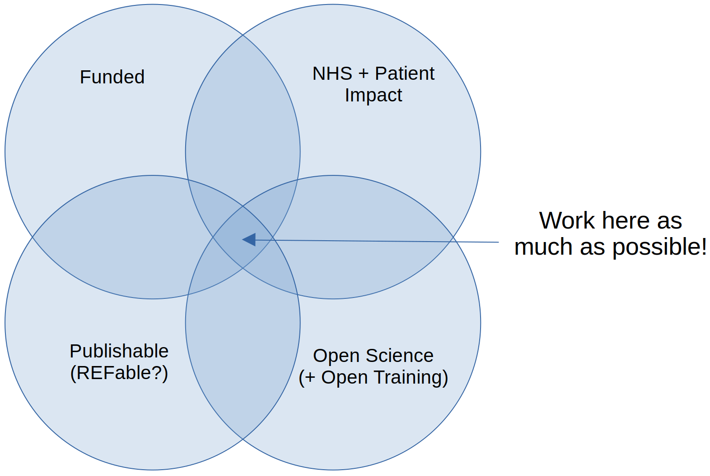

# PenCHORD : Management Proposal 2024

(Approved by ARC management 16/1/2024, to be put in place from 1st March 2024)
 
The following document outlines the central principles of the proposed new management structure of the team. 
## Summary
Steady as she goes. No radical change. We are optimistic and positive about ourselves - we have a brilliant track record of delivering, and will keep on delivering impact, funding, papers, and NHS capacity-building. We will keep our focus on the areas that have been working well. We will have stable strategy, so that everyone knows what we do and don’t do. We will prioritise sustainability of, and growth in, our chosen work areas, and sustainability of employment, as far as we can. We will be known as the leading open science team in health services modelling and data science - we will be so good in this area of strategic focus that we can’t be ignored or overlooked. Over time we will consider where/what we want to grow from the base we have, but only as we have the capacity. We won’t promise anything (to ARC leadership, to partners, to the NHS) that we don’t think we can, and will, deliver. We will have fun with data science along the way - we see play as an important way to learn. We will look after each other.
 
We try to work in the overlap between 1) funding, 2) NHS/Patient impact, 3) Publishable (REFable), and 4) Open Science (and Open Training)

## FOCUS OF THE TEAM AND STRATEGIC VISION
 
 The team will build on our national and international reputation in open and applied modelling and data science for health and social care. Our vision continues to be driven by the objectives of the NIHR ARC programme. We lead on research to support the NHS to improve patient care using data science initiatives in research translation, significant capacity building, applied health research with associated impact stories, peer-reviewed journal articles, and research dissemination. We will set new standards in open science for medicine and health service research and use ARC infrastructure to leverage additional funding from NIHR, UKRI and other funders.  We will work to support the ARC to adopt open science practices in quantitative work across its research teams.
 
## AREAS OF LEADERSHIP

For the last 6 years the team has been building leadership on the following areas.

Embedding data science capacity in the NHS: we will deliver this via the HSMA Programme in collaboration with the Digital Academy and other funders. Our programme has a close trajectory to patient benefit. We will exploit our strong links with the regional and national NHS partners as a pipeline to adapt and translate our open research into frontline NHS services.

Leveraging data science to optimise clinical pathways: We will work with national audits in stroke, maternity, and intensive care to reduce clinical variation, streamline patient pathways, and optimise workforce decisions to support the NHS improve patient outcomes. We will deliver this by leveraging ARC infrastructure for pilot work and substantive data science grants from funders such as NIHR, and UKRI MRC.

Enabling research translation through open science: We will continue to build on our national reputation in delivering applied data science that is trustworthy, transparent and translatable across our NHS partners. We will deliver this through an evolution of our methods to optimise patient pathways, building capacity and capability in modern Free and Open Source Software, and leveraging substantive funding from UKRI with our strategic partners. By the end of the ARC we will have an international reputation in open science methods research in medicine and health.

## PATHWAYS TO IMPACT

**Economic and and societal impact**: Our pathway continues to follow the group’s 13+ years approach to research impact - building meaningful and long term partnerships with research users in the NHS. The proposed co-chairs have individually collaborated with over 100 NHS organisations. Recent examples include:

- **Stroke thrombolysis and thrombectomy** (in collaboration with NIHR, the national stroke audit, NHS-England, NHS-Elect, and regional stroke organisations and ICBs). Example impacts have included our work in regional planning for stroke thrombectomy contracted by national planning committees for England, Scotland, and Northern Ireland. It has also been adopted in [national guidelines](https://www.healthinnovationoxford.org/wp-content/uploads/2022/02/Mechanical-Thrombectomy-for-Ischaemic-Stroke-February-2022.pdf), influencing NHS stroke service planning across all home nations in the UK. The SAMueL work is cited in the NHS national clinical guidelines for stroke, and is being applied to improving use of thrombolysis through NHS-England’s thrombolysis in acute stroke collaboration (TASC) programme.    safe ICU staffing and patient flow in collaboration with University of Southampton NHS Trust Portsmouth Hospitals University NHS Trust, and Nottingham University Hospitals Trust.
- Our **HSMA programme** has upskilled over 260 NHS employees across over 100 organisations in advanced data science targeted at improving patient care.  The programme has led to significant impact, including the construction of £multi-millon new mental health facilities, support for the COVID-19 mass vaccination programme, transformative improvements in urgent care and the establishment of brand new modelling and data science teams within NHS organisations. We currently have over 330 people in our HSMA community. HSMA has mentored over 60 modelling projects in areas such as emergency departments, mental health, primary care and elective surgery.  The HSMA Programme has recently undergone a transformation to its structure, allowing for a significant increase in the capacity of projects that can be mentored via community mentoring, vastly expanding the modelling and data science resource available to the team. The [HSMA YouTube Channel](https://www.youtube.com/@hsma) has over 1,300 subscribers (and growing!), and our 118 training videos have been viewed over 120,000 times across the world.  

**Academic impact**: Our three leadership areas have been carefully selected to position us at the leading edge of data science methods applied to improve the organisation of patient care.  We already have a strong and respected reputation and academic presence in the organisation of stroke services, which we will build on. We will, more generally, enhance, adapt, teach and apply novel data science methods such as causal inference, explainable AI, and modern open pathway simulation models to important health service delivery problems facing the NHS and health services internationally. These NHS problems will be studied through multi-site, regional and national research studies and datasets. We will conduct open science research to reduce research waste, duplication and speed up the transfer of benefits to patients. We will disseminate new knowledge efficiently to clinical and health data science audiences via journals prioritised by relevance, fast turnaround times, and open science policies.

## TEAM MANAGEMENT AND LEADERSHIP:
## Leadership responsibility: 

Leadership will be the joint responsibility of Tom, Dan and Mike (who, together, have a strong track record of delivery and anticipation of changes in the OR/Data Science landscape - leading PenCHORD’s transition to a data-science-capable team, using leading-edge open AI techniques). Working with ARC leadership and PenCHORD team members, they will together be responsible for the strategic vision of PenCHORD (which will be reviewed yearly). We will use Roger Martin’s framework for defining strategy:

**STRATEGY**: An integrated set of choices that define our playing field, and how we will succeed:

* **Integrated**: Choices work together to achieve the desired aim.
* **Choices**: Involves choosing what to do, and what NOT to do.
* **Playing field**: Where are we working (and therefore not working).
* **How**: How we will do things that separate ourselves from others?
* **Succeeding**: Creating clear value, so that we become a first-choice provider in our playing field.  

Management and Leadership Structure: The team will be led by a chair using a “rotating chair” structure between senior academics with a shared vision within the team (initially Dan Chalk, Mike Allen and Tom Monks).  Each chair will act as the lead for the team and the primary point of contact during their tenure, with tenures lasting approximately 6 months at a time.  At any one time, a single chair will be in place as a clear point of contact for the team’s leadership, but will also work in consultation with the other chairs to determine and achieve long-term plans and strategic aims.

The rotating chair structure will allow for a shared vision but also provide an opportunity for individuals with particular expertise to help shape the future of the team.  To that end, each of the three co-chairs will lead on a particular aspect of the team’s strategy and workload, and will be the primary decision maker for project work and strategic development within their theme : 

- Dan Chalk (Capacity Development and opportunistic project work)   
- Mike Allen (Use and development of AI methods to support optimisation of clinical pathways )
- Tom Monks (Development and promotion of open modelling and data science for the NHS)

In addition to the chairs, the management team will also receive support from a Research and Operations Manager (Chrissie Walker) who will help to link up our work with other workstreams in the ARC, feed back on potential opportunities, and link up the chairs with local and national contacts that can help the work of our strategic vision.

**Open Management**: The current chair, alongside the Research and Operations Manager, will attend ARC-level meetings to promote the work of the team, disseminate impact from their work, and maintain awareness of the work of the wider ARC (including potential collaborative opportunities).

A core principle of our management will be openness and transparency.  Management meetings will be open to all members of the team to contribute by actively participating in the meeting and its discussions and / or putting forward issues to be discussed.  Similarly, outcomes from management meetings and ARC-level meetings will be fed back to those in the team to ensure the team remains aware of developments.

**Management meetings** will typically be held once a month, and will be split between team management matters and a separate tutorial / showcase session.  The latter will be used as a space for team members to demonstrate and / or teach something they’ve been working with, or for HSMAs and HSMA alumni to talk about their work.  This will promote impact tracking as well as support the development of our team members, which is an important aspect of our team.

**Team Size and Growth**: During the existing ARC and ARC extension, the focus will be solely on ensuring the security of existing team members.  For any next iteration of ARC, the focus will be on sustainability and growth that supports our strategic vision.  One key area of intended growth will be the HSMA sub-team, to not only expand the capacity of the HSMA programme, but also to support increased adhoc project support within the team.  The intention will be for this expansion to come primarily from long-term funding partners of the HSMA programme.  Other areas of expansion will be reviewed by the management team as needs arise, but retaining a primary focus on the security and career development of existing team members.

**Engagement with the Wider ARC**: The team is committed to delivering work that meets the objectives of the ARC, and continues to have a strong history in doing so.  In addition to ensuring engagement from the team at ARC-level meetings to feed in and increase awareness of work elsewhere in the ARC (as described above), we will also : 

- Organise a workshop session for the ARC, early in the new management, in which the team showcases their work and its impact, talks about the expertise and specialism of the team (and it’s direct link to ARC strategy) and provides a mechanism for discussion to explore potential collaborative opportunities in open science for quantitative work    
- Commit to engage regularly with the PenARC Executive Communication series to showcase the work of the team and increase engagement
    
In addition, we will also continue to promote our existing events (such as the HSMA Open Day) strongly to PenARC to encourage those within the ARC to hear more about our work and its associated impact.

## Strategic Partners

- University of Exeter Business School: [Centre for Simulation, Analytics and Modelling](https://www.exeter.ac.uk/research/centres/csam/). Key collaborator [Prof Navonil Mustafee](https://business-school.exeter.ac.uk/people/profile/index.php?web_id=Navonil_Mustafee)
- University of Exeter [Institute of Data Science and Artificial Intelligence](https://www.exeter.ac.uk/research/institutes/idsai/) (IDSAI). Key collaborator [Prof Richard Everson](https://computerscience.exeter.ac.uk/staff/reverson?sm=reverson)
- [Clinical Operational Research Unit](https://www.ucl.ac.uk/clinical-operational-research-unit/clinical-operational-research-unit-coru) (CORU), UCL. Key collaborator [Prof Sonya Crowe.](https://profiles.ucl.ac.uk/8637-sonya-crowe)
- [NHS Digital Academy](https://www.england.nhs.uk/digitaltechnology/nhs-digital-academy/) Key collaborator [James Freed](https://www.england.nhs.uk/author/james-freed/)
- [SUSTAIN SW](https://plymouth-neuroimaging.github.io/people.html) Key collaborators - Dr Stephen Mullin: Associate Professor and Honorary Consultant in Neurology, Plymouth, and Dr. Mark Thurston, Consultant Radiologist, Plymouth
- National Partners for Stroke Work:
	- Prof. Martin James: Consultant clinician (RD&E) and clinical lead of the Sentinel Stroke National Clinical Audit
	- Prof. Gary Ford: Stroke Clinical Pharmacologist (Oxford) and Chair of the AHSN Network
	- Dr. Peter McMeekin: Associate Professor, health economics, specialising in stroke, Northumbria University
	- Prof. Phil White: Consultant interventional neuroradiologist, specialising in stroke and thrombectomy
	- Prof. Chris Price: Professor of Stroke and Applied Health Research, Newcastle
- Maternity Work:
	* Prof. Steve Thornton: Queen Mary University, London
	* Prof. Phil Steer: Imperial College, London